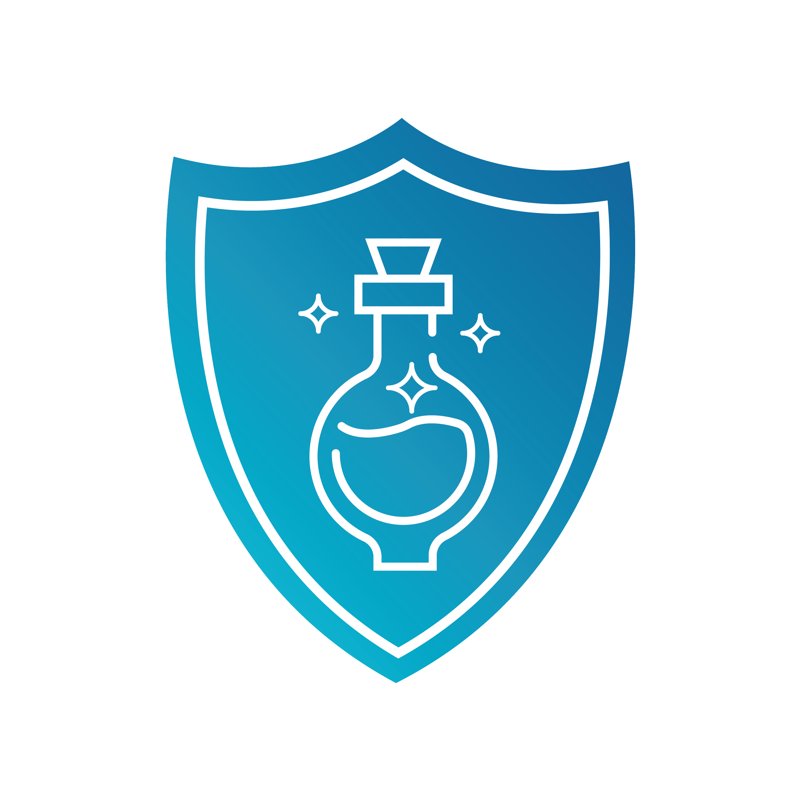

# Opensourcery React!

## Getting started

1. Install node [here](https://nodejs.org/en/download/)

2. Click the fork button on the github repo. This will create a repository on your github account that is a copy of ours.


2. Clone down the repo you forked
```
    git clone <url to forked repo>
    cd React-Workshop
```

3. Install Packges ( may take a bit )
```
    npm i
```

4. Run Project
```
    npm run start
```

You should see your browser open to `localhost:3000` and see the home page of the project

## Editing

The project is divided into pages and we are using AWS to track the views on each page. To create a new page, follow the steps below.

1. Copy-Paste Home.js and use it as a template for a page

2. Rename the file

3. Edit the `describe` function in to describe your page. This will determine how it shows up in the pagelist

4. Include an image for your pages. Images are loaded from the `public` folder or through urls directly

5. Update the `routes` variable in `./src/pages/_.js` to reference your new page. The key will be the route to your page.

6. Your page should now show up on the `Pagelist`, Views will be tracked through AWS automaticly. When clicked it will bring you to the page itself.

## Git

This project is ment to be a community activity. Grab your friend, have them learn a bit of react and push their page! We want to see everyones react skils!

Once you like your changes, push them to the repo with the following.

1. Commit your changes

```
    git add -A
    git commit -m "Description of my changes"
```

2. Push your changes to your repo

```
    git push
```

3. Send a pull request to add your code to the master repo. This will allow us to look at your page and then aprove it to be added to everyones project!

